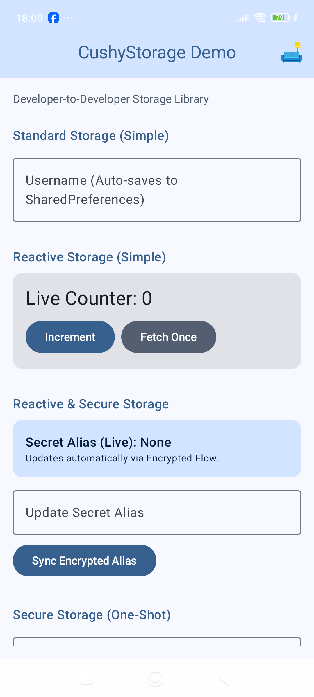
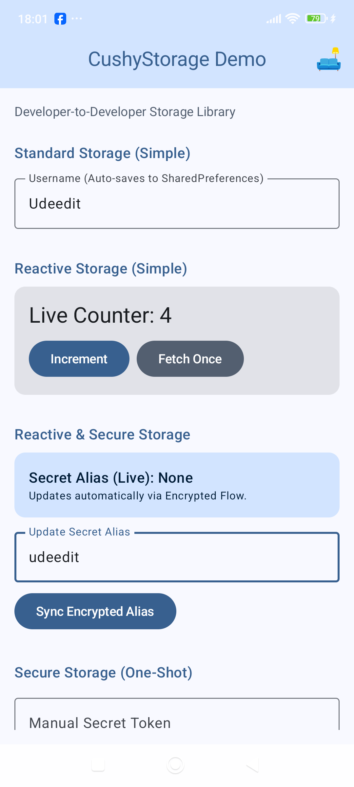
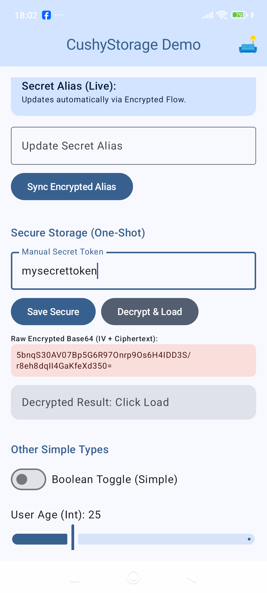
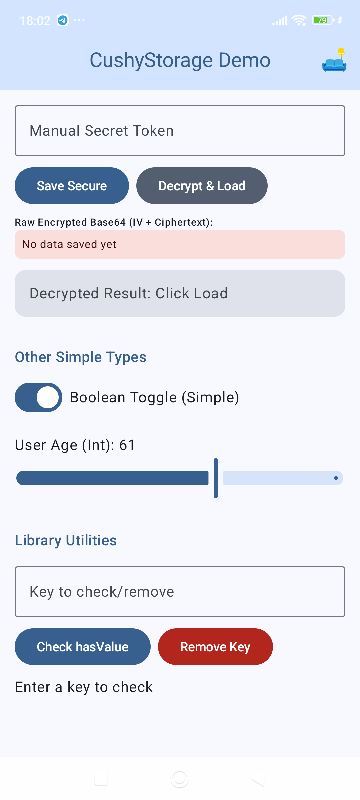
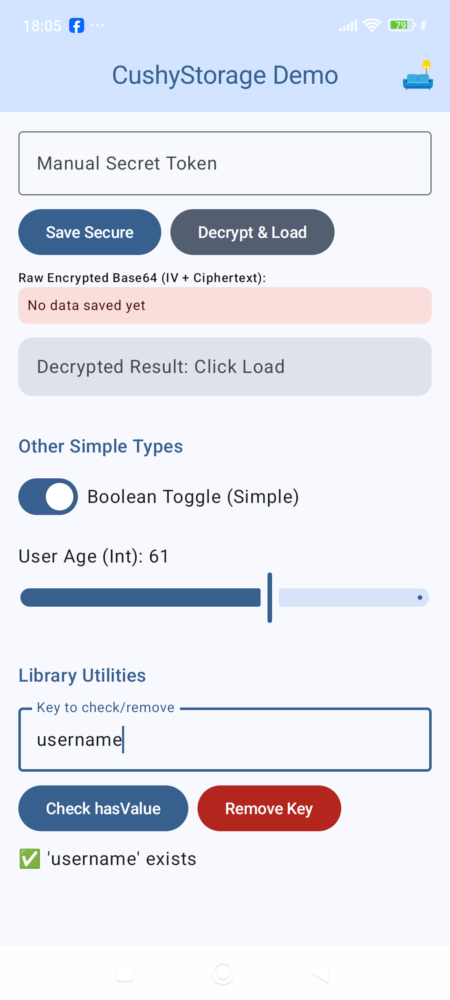
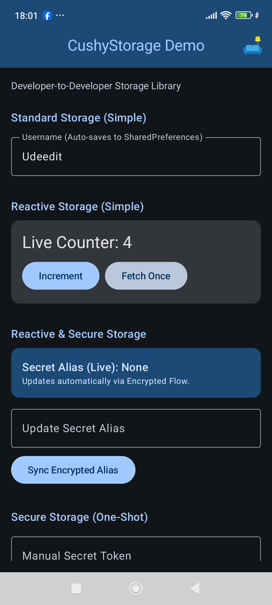
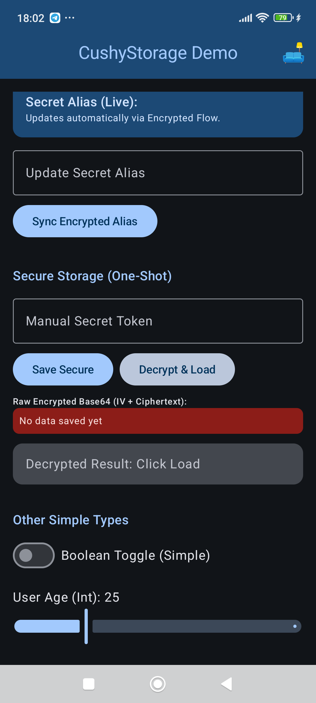
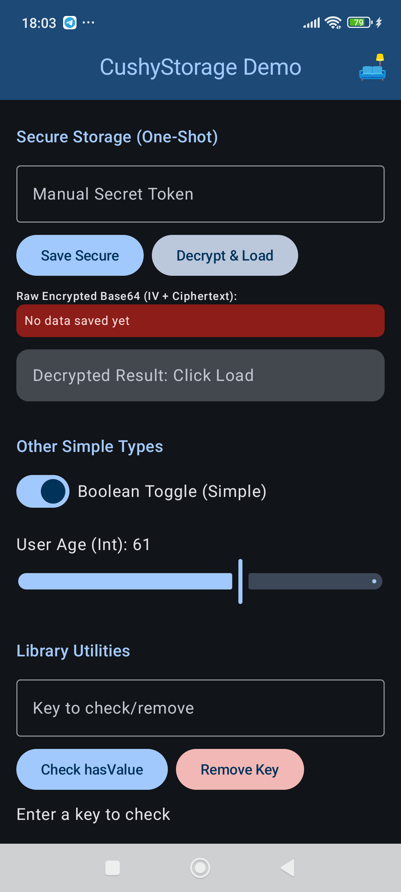
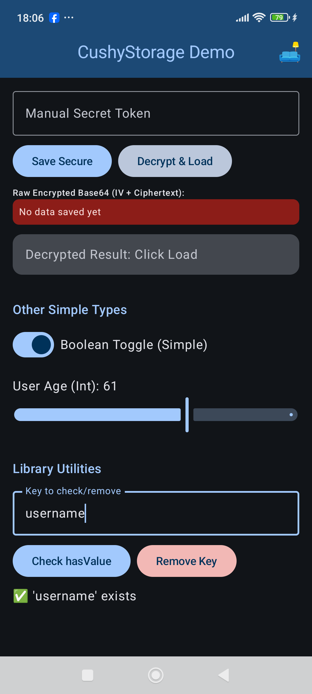

# CushyStorage 🛋️

A unified, ultra-comfortable wrapper for Android Preferences.

CushyStorage eliminates the complexity of Android data persistence by providing a single, "flat" API that handles standard SharedPreferences, reactive DataStore flows, and hardware-secured AES-GCM encryption.

---

## 📸 Visual Showcase

<p align="center">
  <b>CushyStorage Demo Light</b><br>
    
    
    
    
    
</p>

<p align="center">
  <b>CushyStorage Demo Light</b><br>
    
    
    
    
</p>

> Tip: Use the interactive demo in the :app module to see these features in action.

---

## 🏗️ Architecture: The Three Layers

1. Standard (Simple): Fast, synchronous persistence for UI states and non-sensitive settings.
2. Reactive (Simple): Asynchronous, thread-safe Flow updates via Jetpack DataStore.
3. Secure (Encrypted): Hardware-backed encryption replacing the deprecated EncryptedSharedPreferences.

---

## 🛠️ API Reference & Implementation

### 1. Initialization
Initialize once in your Application class to set up the engines globally. 

```kotlin
class MyApp : Application() { 
    override fun onCreate() { 
        super.onCreate()

        // Recommended: Default initialization
        CushyStorage.init(this) 
         
        // Optional: Advanced Security Configuration 
        val config = CushyConfig(keySize = 256, tagSizeBits = 128) 
        CushyStorage.init(this, config) 
    }
}
```

### 2. Standard Storage (Simple)
Perfect for non-sensitive data like usernames, toggles, or user settings.

```kotlin
// --- Strings --- 
CushyStorage.saveString("username", "Alex") 
val name = CushyStorage.getString("username", "Guest") 
 
// --- Booleans --- 
CushyStorage.saveBoolean("is_premium", true) 
val isPremium = CushyStorage.getBoolean("is_premium", false) 
 
// --- Integers --- 
CushyStorage.saveInt("app_launches", 5) 
val launchCount = CushyStorage.getInt("app_launches", 0) 
```

### 3. Reactive Storage (Simple)
Designed for modern UIs (Jetpack Compose) where data needs to update instantly.

```kotlin
// Save Asynchronously 
scope.launch { 
    CushyStorage.saveStringReactive("live_counter", "10") 
} 

// Observe Changes (Reactive Flow) 
val counter by CushyStorage.observeString("live_counter", "0").collectAsStateWithLifecycle() 
 
// One-Shot Fetch from DataStore 
scope.launch { 
    val currentVal = CushyStorage.getStringReactiveOnce("live_counter") 
} 
```

### 4. Secure Storage (Encrypted)
Uses AES-GCM and the Android KeyStore to protect sensitive information.

```kotlin
// Encrypt and Save 
scope.launch { 
    CushyStorage.saveStringEncrypted("user_token", "jwt_secret_data") 
} 
 
// Decrypt and Fetch Once 
scope.launch { 
    val decryptedToken = CushyStorage.getStringEncrypted("user_token") 
} 
 
// Observe & Auto-Decrypt (The Power Layer) 
// Decrypts data in the background and pushes plain-text to the UI 
val secureAlias by CushyStorage.observeStringEncrypted("secret_alias").collectAsStateWithLifecycle() 
 
// Debug Utility: See the raw scrambled text (IV + Ciphertext) 
val raw = CushyStorage.getRawStringEncrypted("user_token") 
```

### 5. Utilities & Housekeeping
Unified tools to manage your storage across all layers.

```kotlin 
// Check if a key exists (in simple layer) 
val exists = CushyStorage.hasValue("username") 
 
// Unified Remove: Surgically delete a key from ALL layers 
scope.launch { 
    CushyStorage.remove("user_token") 
} 
```

---

## 🔐 Security Specification

CushyStorage is built on industry-standard security principles:
- Galois/Counter Mode (GCM): Provides both confidentiality and authenticity.
- Hardware Security: Keys are stored in the device's Trusted Environment (TEE) where available.
- Randomized IV: A unique IV is generated for every write, ensuring high cryptographic entropy.
- Preview Safety: Internal isPreview gate prevents KeyStore crashes in Android Studio.

---

## 📄 License
This project is licensed under the MIT License.

---
Developed with ❤️ by UDeedIt - Focus on your app's logic, we'll handle the "Cushy" storage.